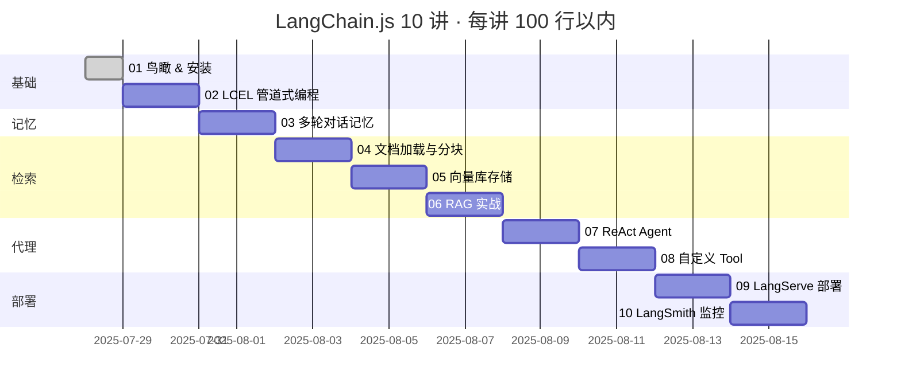

# LangChain.js 100 行系列 - 01 · Hello LLM

《用 100 行 TypeScript 把 LLM 搬进你的全栈应用》  
系列 01 · Hello LLM：5行代码，让JS开发者也能玩转ChatGPT！  
（阅读时长 ≈ 6 min，动手 5 min）

---

## 1. 为什么再写一篇 LangChain.js 教程？

市面上已有不少"XX 入门到精通"，但要么  
• 默认你懂 Python / 机器学习，要么  
• 一口气把全部概念倒给你，读到第 3 节就劝退。  

本系列目标：**从 0 到 1 用 100 行以内 TS 代码，跑完 4 个典型场景**（聊天 → 记忆 → RAG → Agent）。  
每篇都能独立运行，对应 GitHub Tag（v01…v10），可一键克隆。  

读完本文，你会：  
1. 说出 LangChain.js 与 Python 版的 3 个关键差异；  
2. 用 5 行代码问出第一个 LLM 问题；  
3. 拿到一张 4 周学习路线图。  

---

## 2. 30 秒认识 LangChain.js

一句话：  
> LangChain.js = 帮你把大模型（OpenAI、Claude、Gemini…）"接"进 JS 世界的胶水框架。  

它能帮你做 4 件事：  
| 能力         | 一句话解释                      | 本篇是否展开 |
|--------------|---------------------------------|--------------|
| Model I/O    | 把任何 LLM 包装成可调用的函数   | ✅            |
| Prompt       | 模板 + 变量 = 动态提问          | ✅            |
| Memory       | 多轮对话不丢上下文              | 第 03 篇      |
| Agent + Tool | 让模型自己决定调用 API / 查资料 | 第 06 篇      |

---

## 3. 与 Python 版的三处"灵魂差异"

| 维度        | Python LangChain           | LangChain.js                            |
|-------------|----------------------------|-----------------------------------------|
| API 风格    | 面向对象为主               | 函数式（LCEL）+ 面向对象                |
| 运行环境    | 主要是 Python 后端          | Node.js、浏览器、Deno、CF Workers…      |
| 包管理      | `pip install langchain`    | 多包：`@langchain/core`、`@langchain/openai`… |

💡 记住：概念 1:1 对应，代码基本能"翻译"。

---

## 4. 5 行代码跑通 Hello LLM

> 不想装环境？直接打开浏览器 👉  [Live Demo](https://echovic.github.io/langchainjs-100-lines/examples/01-hello/browser-demo.html)
> 
> 或者使用 CodeSandbox 👉  [在线体验](https://codesandbox.io/p/github/echoVic/langchainjs-100-lines/main?import=true)
> 
> 你也可以创建自己的CodeSandbox：
> 1. 访问 [codesandbox.io](https://codesandbox.io)
> 2. 选择 "Import from GitHub"
> 3. 输入仓库地址：`echoVic/langchainjs-100-lines`
> 4. 点击 "Create Sandbox"

```ts
import { ChatOpenAI } from "@langchain/openai";

const llm = new ChatOpenAI({ openAIApiKey: process.env.OPENAI_API_KEY });
const res = await llm.invoke("用一句话介绍 LangChain.js");
console.log(res.content);
```
运行：  
```bash
OPENAI_API_KEY=sk-xxx npx tsx src/hello.ts
```
输出示例：  
```
LangChain.js是一个基于JavaScript的语言链库，可以帮助开发者快速实现多语言支持的功能。
```

---

## 5. 系列路线图（4 周，10 讲）



> 每篇对应一个 GitHub Tag：`v01`…`v10`，可 `git checkout v03` 直接跳到第 3 讲。

---

## 6. 下一步

**立即体验**
- [在线跑代码](https://codesandbox.io/p/github/echoVic/langchainjs-100-lines/main?import=true) - 无需安装
- [本地浏览器演示](browser-demo.html) - 零配置运行

**本地开发**
```bash
git clone https://github.com/echoVic/langchainjs-100-lines.git
cd langchainjs-100-lines && pnpm install
```

**第02讲预告**  

🚀 把5行代码变成1行链式管道，部署到Vercel Edge Function

---

## 7. 小结（1 张图 + 1 句话）

```
┌────────────┐     ┌────────────┐     ┌────────────┐
│  Model I/O │────▶│   Prompt   │────▶│  Output    │
└────────────┘     └────────────┘     └────────────┘
```
> 今天你先跑通“直线”流程；下一篇我们把它弯成可重用的 LCEL 管道。  

---

🚀 点击右上角 Star，下次见！