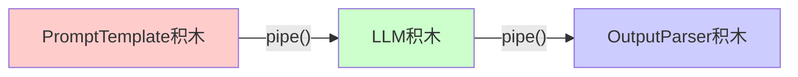

# LangChain.js 100 行系列 - 02 · LCEL 管道式编程

《用 100 行 TypeScript 把 LLM 搬进你的全栈应用》  
系列 02 · LCEL 管道式编程：把 5 行代码压缩成 1 行链  
（阅读时长 ≈ 8 min，动手 10 min）

---

## 项目结构

```
examples/02-lcel/
├── index.ts              # 主程序 - LCEL 管道实现
├── index.test.ts         # 单元测试
├── browser-demo.html     # 浏览器演示
└── README.md            # 本文档
```

---

## 1. 回顾 & 目标

上一篇我们用 5 行代码让 LLM 第一次开口说话：  

```ts
const res = await llm.invoke("用一句话介绍 LangChain.js");
```

本篇只干一件事：  
> 把这 5 行压缩成 **1 行链**，并且让它  
> • 支持**流式输出** • 可**同步 / 异步**调用 • 类型 100% 安全  

完成后你将得到一条可复用的 `Runnable`，后续任何 Prompt / 模型替换都**零改动**。

---

## 2. 什么是 LCEL？

LCEL（LangChain Expression Language）= 把每个组件抽象成 **Runnable**，再用 **管道符** 串起来。  

### LCEL 就像搭积木

想象一下：
- **Runnable** = 单个积木块
- **pipe()** = 积木的拼接接口  
- **RunnableSequence** = 一排连接的积木



每个组件都有标准接口，可以完美拼接，就像这样：
```
PromptTemplate → LLM → OutputParser
```

说实话，刚开始我也觉得 LCEL 有点抽象，但用多了就真香了。特别是当你需要频繁调整 Prompt 或者换模型的时候，这种管道式的设计真的很爽。

---

## 3. 快速开始

### 3.1 环境准备

```bash
# 克隆项目
git clone https://github.com/yourname/langchainjs-100-lines
cd langchainjs-100-lines

# 安装依赖
npm install

# 配置环境变量
cp .env.example .env
# 编辑 .env 文件，填入你的 API Key
```

### 3.2 运行示例

```bash
# 运行 02-lcel 主程序
npm run dev:02

# 运行测试
npm run test:02

# 打开浏览器演示
npm run browser:02
```

---

## 4. 核心代码实现

### 4.1 从 5 行到 1 行：流水线对比

| 传统方式（5行分散） | LCEL方式（1行链） |
|---------------------|-------------------|
| 1. 创建prompt变量    |                   |
| 2. 创建llm变量       | **一行链式表达式** |
| 3. 手动连接链        | `RunnableSequence` |
| 4. 调用invoke        | `.from([...])`    |
| 5. 处理输出          | 自动类型推导 ✅    |

说白了就是把一堆零散的代码串成一条链，就像搭积木一样。从手工制作升级到自动化流水线！

### 4.2 完整代码

```ts
// index.ts
import { ChatOpenAI } from "@langchain/openai";
import { PromptTemplate } from "@langchain/core/prompts";
import { StringOutputParser } from "@langchain/core/output_parsers";
import { RunnableSequence } from "@langchain/core/runnables";
import dotenv from "dotenv";

dotenv.config();

// 极简 LCEL 管道 - 把 5 行代码压缩成 1 行链
const prompt = PromptTemplate.fromTemplate(
  "请用一句话介绍 {topic} 的核心特点。"
);

const llm = new ChatOpenAI({
  model: "openai/gpt-3.5-turbo",
  temperature: 0.7,
  configuration: {
    baseURL: process.env.OPENAI_API_BASE || "https://api.openai.com/v1",
    apiKey: process.env.OPENAI_API_KEY,
  },
});

const parser = new StringOutputParser();

// 一行链：Prompt → LLM → OutputParser
const chain = RunnableSequence.from([prompt, llm, parser]);

// 调用链
const response = await chain.invoke({ topic: "LangChain.js" });
console.log(response);

// 演示流式输出 - 实时打字机效果
console.log("\n--- 流式输出演示 ---");
for await (const chunk of await chain.stream({ topic: "LCEL" })) {
  process.stdout.write(chunk);
}
console.log("\n");

// 演示批量处理 - 并行处理
console.log("--- 批量处理演示 ---");
const batchResults = await chain.batch([
  { topic: "TypeScript" },
  { topic: "JavaScript" },
  { topic: "Node.js" }
]);

batchResults.forEach((result, index) => {
  console.log(`${index + 1}. ${result}`);
});
```

运行输出：
```
LangChain.js 是一个帮助 JavaScript 开发者轻松集成大语言模型的开源框架。

--- 流式输出演示 ---
LCEL 是 LangChain 表达式语言，通过管道式编程将复杂的 AI 应用简化为可组合的组件链。

--- 批量处理演示 ---
1. TypeScript 是 JavaScript 的超集，提供静态类型检查和面向对象编程特性。
2. JavaScript 是一种动态类型、解释型编程语言，广泛应用于 Web 开发。
3. Node.js 是基于 Chrome V8 引擎的 JavaScript 运行时，支持服务器端开发。
```

---

## 5. 三把瑞士军刀：batch / stream / async

LCEL 对象都实现统一接口，意味着：

```ts
// 批量提问 - 并行处理
await chain.batch([
  { topic: "LangChain.js" },
  { topic: "LCEL" }
]);

// 流式打字机效果 - 实时输出
for await (const chunk of await chain.stream({ topic: "LCEL" })) {
  process.stdout.write(chunk);
}

// 异步并发 - Promise支持
await chain.ainvoke({ topic: "TypeScript" });
```

**一行链，三种姿势**——零额外代码。

---

## 6. 类型安全 & 调试技巧

### 6.1 TypeScript 推导演示

把鼠标放在 `chain` 上，VS Code 会显示：

```ts
const chain: RunnableSequence<
  { topic: string },   // 输入形状
  string               // 输出类型
>
```

改错变量名会报错，不过有时候类型推导也会出问题，特别是复杂场景下。

### 6.2 调试技巧 - 安装行车记录仪

```ts
// 调试模式 - 查看每一步
const debugChain = chain.withConfig({
  callbacks: [{
    handleChainStart: (chain, inputs) => 
      console.log("开始处理:", inputs),
    handleChainEnd: (chain, outputs) => 
      console.log("处理完成:", outputs)
  }]
});
```

---

## 7. 浏览器演示

运行 `npm run server` 启动服务器，然后在浏览器中体验：

- **单次调用**：传统的一次性请求
- **流式输出**：实时打字机效果
- **批量处理**：同时处理多个主题

无需安装任何环境，直接在浏览器中体验 LCEL 的强大功能！

---

## 8. 30 秒部署到 Vercel Edge

我们已经是一条 Runnable，可以直接塞进 Edge Function：

```ts
// api/chat.ts (Next.js)
import { chain } from "../src/02-lcel";

export default async function handler(req: Request) {
  const { topic } = await req.json();
  const answer = await chain.invoke({ topic });
  return new Response(answer);
}
```

部署即 RESTful API，后面会深入展开。

---

## 9. 进阶技巧

### 9.1 错误处理 - 安全气囊

```ts
import { RunnableWithFallbacks } from "@langchain/core/runnables";

// 主链失败时回退到备用模型
const robustChain = new RunnableWithFallbacks({
  runnable: mainChain,
  fallbacks: [backupChain] // GPT-4 → GPT-3.5
});
```

### 9.2 可复用组件 - AI乐高积木套装

```ts
// 创建标准化专家链
const createLlmChain = (systemPrompt: string) => {
  return PromptTemplate.fromTemplate(systemPrompt)
    .pipe(new ChatOpenAI({ model: "gpt-3.5-turbo" }))
    .pipe(new StringOutputParser());
};

// 不同领域专家
const techExpert = createLlmChain("你是一位技术专家...");
const financeExpert = createLlmChain("你是一位金融专家...");
```

---

## 10. 测试

运行测试确保代码质量：

```bash
npm test
```

测试覆盖：
- 环境变量验证
- LCEL 链创建
- 链方法验证
- 类型安全检查

---

## 11. 小结 & 下集预告

今天我们用 **1 行链**完成了：  
• Prompt 模板化 • 模型调用 • 输出解析 • 流式 & 并发 • 错误处理

就像从手工制作升级到自动化流水线，从单个积木到宏伟城堡！

下一篇（v03）我们将加入 **Memory**，让 AI 记住你上句说了什么。

---

## 一键体验

```bash
# 运行主程序
npm run dev:02

# 运行测试
npm run test:02

# 打开浏览器演示
npm run browser:02
```

---

**思考题**：你最想给哪段业务逻辑套上"一行链"？
